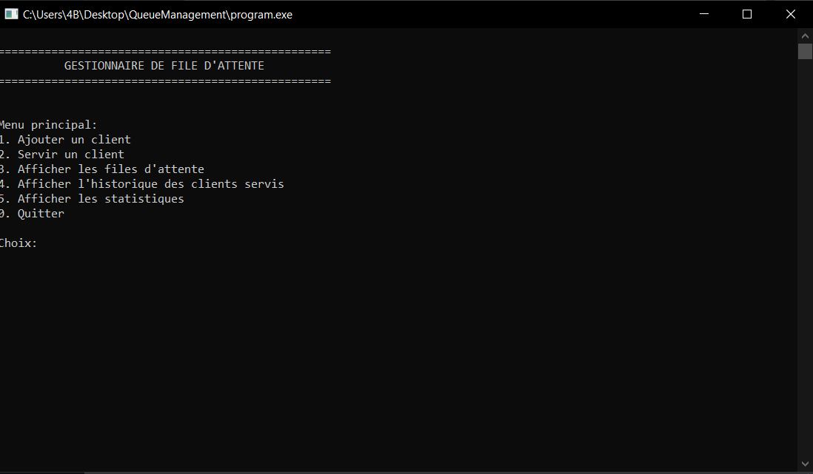
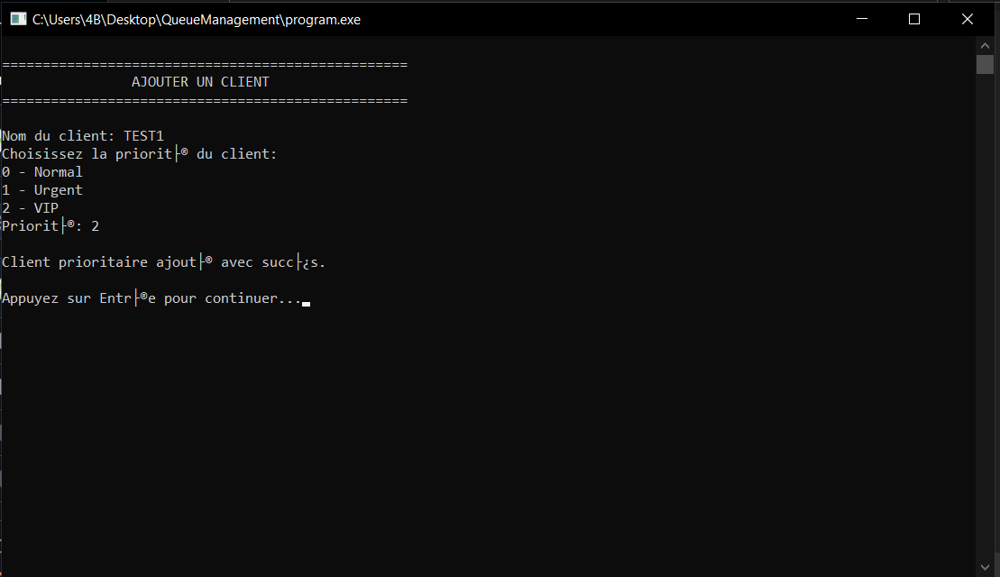
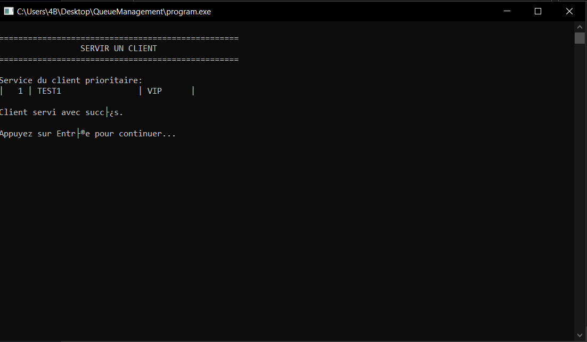
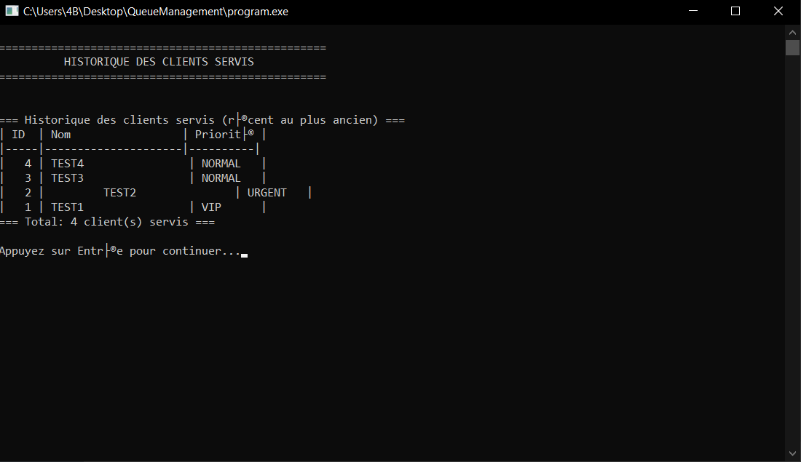

# 🧾 Gestionnaire de File d’Attente pour un Service Client

Ce projet est une application en C simulant un système de gestion de file d’attente pour un service client. Il permet de gérer efficacement les clients ordinaires et prioritaires (VIP, urgences), avec des fonctionnalités comme : ajout, traitement, historique et statistiques.

## 🚀 Fonctionnalités

### 1. 📥 Ajouter un client
- Ajout de clients normaux ou prioritaires.
- Les clients normaux sont insérés dans une file FIFO.
- Les clients prioritaires sont gérés par un tas binaire max (heap), selon leur niveau de priorité.

### 2. 🧾 Servir un client
- Sert d’abord les clients prioritaires.
- En absence de clients prioritaires, sert les clients normaux par ordre d’arrivée.

### 3. 📋 Afficher les files d’attente
- Affiche les clients en attente dans la file normale.
- Affiche les clients prioritaires triés par priorité.

### 4. 🕘 Historique des clients servis
- Sauvegarde des clients servis dans une pile (LIFO).
- Possibilité d’annuler le dernier service.

### 5. 📊 Statistiques
- Nombre total de clients servis.
- Nombre de clients en attente.
- Détails sur les types de clients (VIP, urgences...).

### 6. ❌ Quitter
- Nettoyage de la mémoire dynamique et sortie propre du programme.

---
## 👉 La séquence du programme **(EXEMPLE)**
### 🧩 Étape par étape (d'ancien au récent)

1. **Ajout du client TEST1 avec priorité VIP**   
   Ce client a une **priorité élevée**.  
   - Il est inséré dans la file prioritaire (implémentée en tas binaire max-heap).   
   - Ensuite, il sera servi en priorité avant tous les clients normaux.   

2. **Ajout du client TEST2 avec priorité URGENT** 
   Moins prioritaire que **VIP**, mais plus que **NORMAL**.  
   - S'insère dans le heap selon sa priorité. 
   - Comme **TEST1** est déjà dans le heap, **TEST2** est placé après.  

3. **Ajout du client TEST3 avec priorité NORMAL** 
   - S'insère dans la file d’attente FIFO standard (non prioritaire). 

4. **Ajout du client TEST4 avec priorité NORMAL** 
   - Ajouté aussi dans la file FIFO, derrière **TEST3**.

### ✅ Ordre de traitement simulé

L’algorithme commence par servir les clients de la file prioritaire (**heap**), dans l’ordre de priorité :  

1. **TEST1 (VIP)** 
   - Priorité la plus élevée, servi en premier.  

2. **TEST2 (URGENT)** 
   - Priorité moyenne, servi après TEST1. 

Ensuite, il passe à la file d’attente normale (**FIFO**) :  

3. **TEST3 (NORMAL)** 
   - Premier client de la file FIFO, servi dans l'ordre d'arrivée. 

4. **TEST4 (NORMAL)** 
   - Second client de la file FIFO, servi après TEST3.
### 📌 Historique des clients servis

L’historique des clients servis est stocké dans une **pile (LIFO)** :

| Ordre d'affichage | ID  | Nom    | Priorité |
|-------------------|-----|--------|----------|
| 1er               | 4   | TEST4  | NORMAL   |
| 2e                | 3   | TEST3  | NORMAL   |
| 3e                | 2   | TEST2  | URGENT   |
| 4e                | 1   | TEST1  | VIP      |

---
## 🧱 Structures de données utilisées

| Composant               | Structure utilisée            |
|------------------------|-------------------------------|
| File d'attente normale | Liste chaînée (FIFO Queue)    |
| File prioritaire       | Tas binaire (Max-Heap)        |
| Historique             | Pile (Stack)                  |
| Statistiques/Recherches| Tableaux dynamiques ou arbres |

