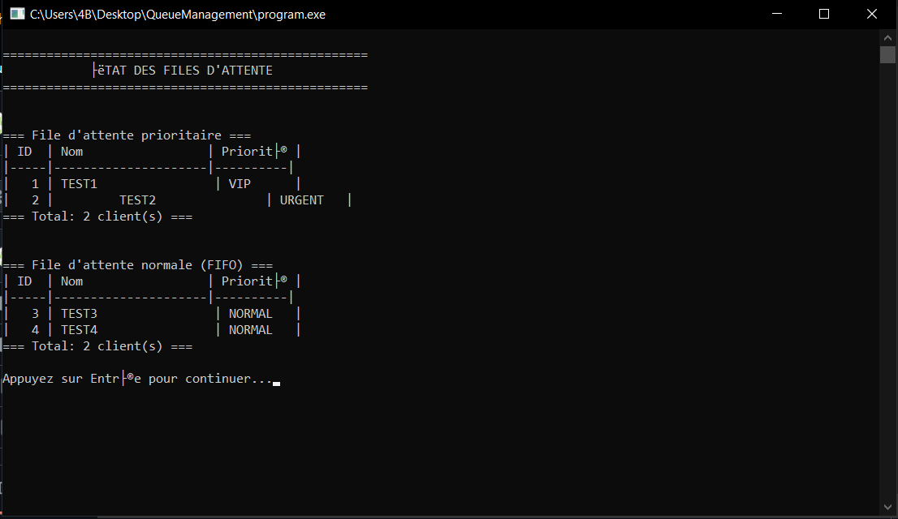

# 🧾 Gestionnaire de File d’Attente pour un Service Client

Ce projet est une application en C simulant un système de gestion de file d’attente pour un service client. Il permet de gérer efficacement les clients ordinaires et prioritaires (VIP, urgences), avec des fonctionnalités comme : ajout, traitement, historique et statistiques.

## 🚀 Fonctionnalités

### 1. 📥 Ajouter un client
- Ajout de clients normaux ou prioritaires.
- Les clients normaux sont insérés dans une file FIFO.
- Les clients prioritaires sont gérés par un tas binaire max (heap), selon leur niveau de priorité.

### 2. 🧾 Servir un client
- Sert d’abord les clients prioritaires.
- En absence de clients prioritaires, sert les clients normaux par ordre d’arrivée.

### 3. 📋 Afficher les files d’attente
- Affiche les clients en attente dans la file normale.
- Affiche les clients prioritaires triés par priorité.

### 4. 🕘 Historique des clients servis
- Sauvegarde des clients servis dans une pile (LIFO).
- Possibilité d’annuler le dernier service.

### 5. 📊 Statistiques
- Nombre total de clients servis.
- Nombre de clients en attente.
- Détails sur les types de clients (VIP, urgences...).

### 6. ❌ Quitter
- Nettoyage de la mémoire dynamique et sortie propre du programme.

---

## 🧱 Structures de données utilisées

| Composant               | Structure utilisée            |
|------------------------|-------------------------------|
| File d'attente normale | Liste chaînée (FIFO Queue)    |
| File prioritaire       | Tas binaire (Max-Heap)        |
| Historique             | Pile (Stack)                  |
| Statistiques/Recherches| Tableaux dynamiques ou arbres |

